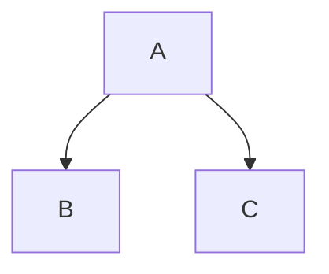

## Markdown Example

- headings
  # Header
- unorder list
  - ul1
  - ul2
  - ul3
- ordered list
  1. ol
  2. ol2
  3. ol3
- text formating
  - Formatted *italic* **bold** 
- code
  `npm start`
- table
  |Item|Price|
  |----|-----|
  |milk|3.00|
  |bread|1.00|
- links
  [Google](https://www.google.ca)
- images
  
- expandable section
  

Task lists
 
    
    ### tasklist
    - [x] iteam 1
    - [ ] Iteam 2
    - [ ] item3
  

- autolinks
  Codyle212/Github-Example#3
### Dags

